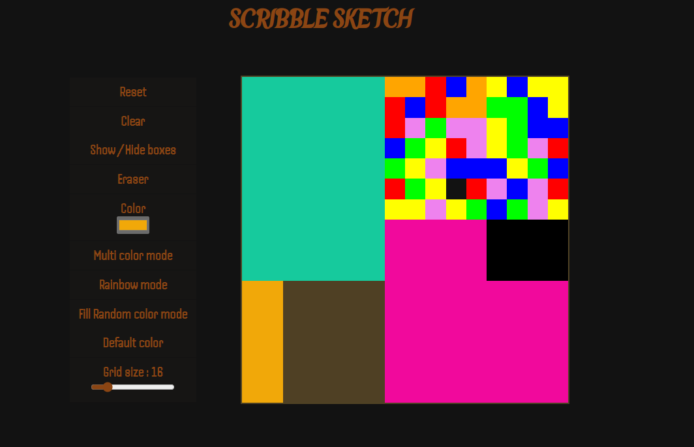

# TABLE OF CONTENTS

1.[Description](#Description)  2.[Purpose](#Purpose)  3.[Features](#Features)  4.[Usage](#Usage) 5.[Where to Play](#Where\To\Play)

# Description

This project is a browser version of a [sketchpad](https://en.wikipedia.org/wiki/Sketchpad) and an [Etch a Sketch](https://en.wikipedia.org/wiki/Etch_A_Sketch).

# Purpose

- To flex and practice my DOM manipulation skills.
- To practice using CSS layout algorithms and selectors.
- To have fun while at it!

# Features

The modes included in this project are:

- Reset - Clear the whole grid plus any other active modes.
- Clear - Remove all background color on the grid.
- Show/Hide boxes - Toggle visibility of the squares in the grid.
- Eraser - Mimic the behaviour of an eraser by removing color on individual squares in the grid on hover.
- Color - Colorpicker lets you chose any color you want to draw.
- Multi color mode - Get a random color to draw on every click.
- Rainbow mode - Get a random rainbow color per square displayed on the grid on hover.
- Fill Random color mode - Fill the entire grid with a random color on every click.
- Default color - Reappply the original color mode.
- Grid size - Re-position the slider to select a new grid size. By default a (16 by 16) grid is applied.

# Usage

Apply colors by hovering over the grid. Activate the modes by clicking on their respective buttons. You can learn about the modes [here](#features).

# Where To Play

This is a browser version, you can find it [here](https://eddy518.github.io/etch-a-sketch/).
